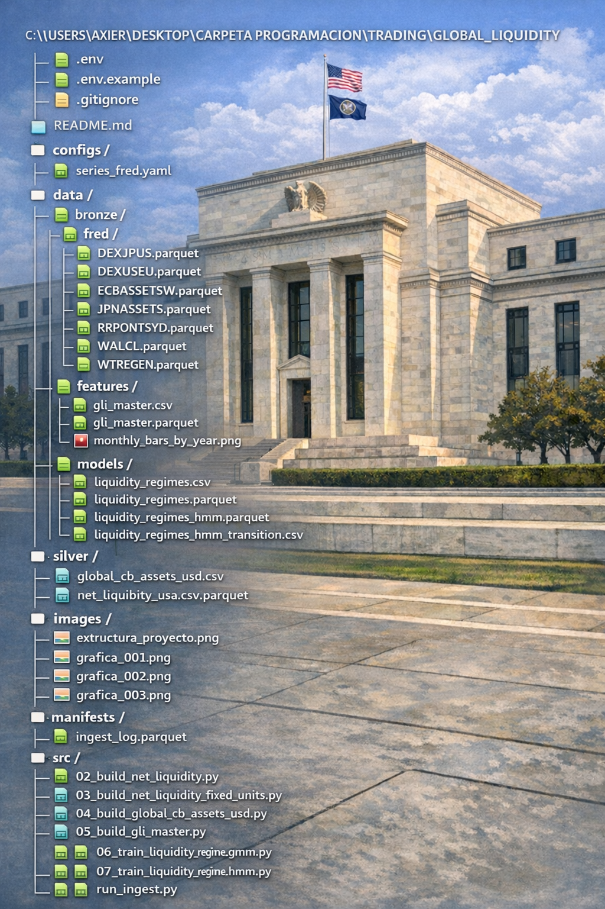
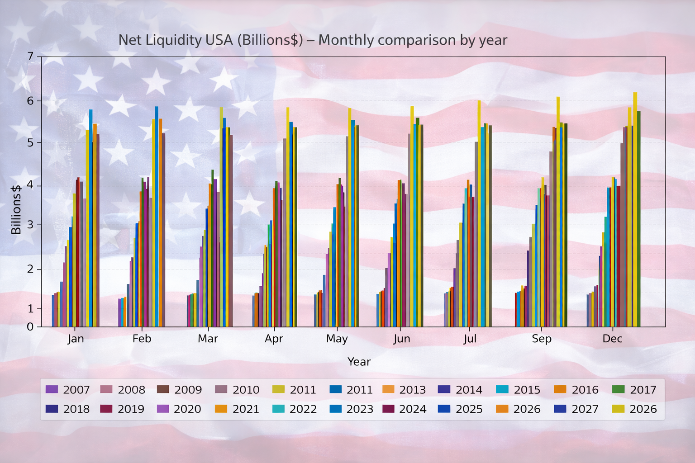
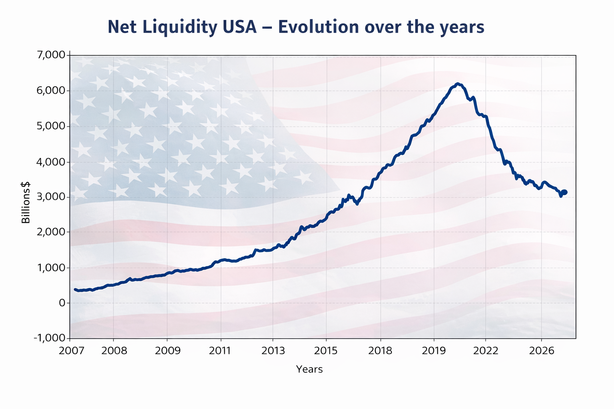
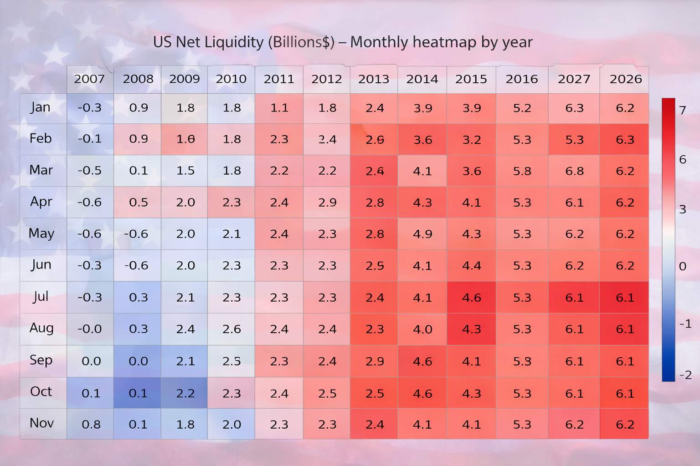

````markdown
# 🌍 Global Liquidity Monitor  
### Net Liquidity USA · Global Central Banks · Liquidity Regimes (GMM / HMM)

Proyecto de **análisis macroeconómico y financiero** centrado en la **liquidez global**, con foco especial en la **Net Liquidity de Estados Unidos**, combinando:

- 📥 Ingesta automática de datos macro (FRED / SDMX)
- 🧱 Pipeline por capas (bronze → silver → features → models)
- 📊 Visualización avanzada (estacionalidad, evolución temporal, heatmaps)
- 🤖 Modelado de **regímenes de liquidez** (GMM & HMM)
- 🔁 Actualización incremental semanal automatizada

---

## 🧠 ¿Por qué importa la liquidez?

La **liquidez global** es uno de los principales drivers de:
- mercados de riesgo (equities, crypto)
- ciclos macroeconómicos
- fases de expansión / contracción

Este proyecto permite **medirla, visualizarla y modelar sus regímenes** de forma sistemática.

---

## 🗂️ Estructura del proyecto


```text
configs/    → configuración de series macro (FRED / SDMX)
data/
  bronze/   → datos crudos descargados
  silver/   → series limpias y normalizadas
  features/ → datasets finales para análisis / ML
  models/   → salidas de modelos GMM / HMM
images/     → gráficos y visualizaciones
manifests/  → logs de ingesta incremental
src/        → código del pipeline
````

---

## 📥 1. Ingesta de datos macroeconómicos

### Fuentes

* **FRED** (Federal Reserve Economic Data)
* **SDMX** (Bancos Centrales)

Configuradas en:

```bash
configs/series_fred.yaml
```

Scripts clave:

```bash
src/ingest/fred.py
src/ingest/sdmx.py
src/run_ingest.py
```

Los datos crudos se almacenan en:

```text
data/bronze/fred/*.parquet
```

---

## 🧱 2. Construcción de Net Liquidity USA

### Definición simplificada

```text
Net Liquidity USA =
  Fed Total Assets
- Reverse Repo
- Treasury General Account
```

Scripts:

```bash
02_build_net_liquidity.py
03_build_net_liquidity_fixed_units.py
```

Salida principal:

```text
data/silver/net_liquidity_usa_fixed.parquet
```

👉 **Este es el archivo base para visualizaciones macro**

---

## 🌐 3. Global Liquidity Index (GLI)

Se construye un índice agregado combinando:

* EEUU
* Japón
* Europa

Script:

```bash
05_build_gli_master.py
```

Salida:

```text
data/features/gli_master.parquet
```

Este dataset está pensado para **modelos y análisis cuantitativo**, no para gráficos macro directos.

---

## 🤖 4. Modelado de regímenes de liquidez

Se entrenan modelos no supervisados para detectar **fases estructurales** del ciclo de liquidez:

### 🔹 Gaussian Mixture Model (GMM)

```bash
06_train_liquidity_regime_gmm.py
```

### 🔹 Hidden Markov Model (HMM)

```bash
07_train_liquidity_regime_hmm.py
```

Salidas:

```text
data/models/liquidity_regimes.parquet
data/models/liquidity_regimes_hmm.parquet
data/models/liquidity_regimes_hmm_transition.csv
```

---

## 🔁 5. Actualización semanal automática

El pipeline está diseñado para **mantener histórico + añadir nuevos datos**.

Script principal:

```bash
src/run_weekly_update.py
```

Incluye:

* ingest incremental
* rebuild de series
* reentrenamiento del HMM
* log de ejecución

Logs:

```text
manifests/ingest_log.parquet
```

---

## 📊 6. Visualizaciones clave

### 📊 Estacionalidad mensual (comparación por años)



➡️ Permite detectar **patrones estacionales** y cambios estructurales.

---

### 📈 Evolución temporal de la Net Liquidity USA



➡️ Visión macro clara del ciclo de liquidez a largo plazo.

---

### 🔥 Heatmap mensual por año



➡️ Resume **intensidad y persistencia** de la liquidez por mes y año.

---

## ▶️ Cómo ejecutar el proyecto

### 1️⃣ Crear entorno virtual

```bash
python -m venv .venv
.\.venv\Scripts\activate
pip install -r requirements.txt
```

### 2️⃣ Ejecutar pipeline completo

```bash
python src/run_ingest.py
```

### 3️⃣ Actualización semanal

```bash
python src/run_weekly_update.py
```

---

## 🧭 Filosofía del proyecto

* 🔹 Separación clara entre **datos crudos**, **datos limpios** y **features**
* 🔹 Reproducible
* 🔹 Automatizable
* 🔹 Pensado para análisis macro serio y research cuantitativo

---

## 🚀 Posibles extensiones

* Overlay con **Bitcoin / S&P500**
* Señales de riesgo-on / risk-off
* Backtesting de estrategias basadas en regímenes
* Dashboard interactivo (Streamlit)

---

## 👤 Autor

**Axier Sangroniz**
Data Analyst · Quant & Macro Research
GitHub: [https://github.com/AxierSangroniz](https://github.com/AxierSangroniz)

---

⭐ Si este proyecto te resulta útil, **dale una estrella al repo**.

